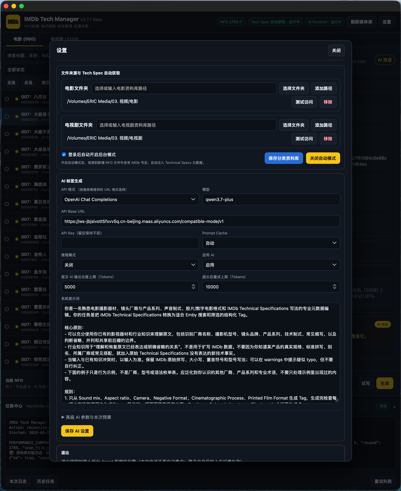

<div align="center">

# IMDb Tech Manager

[简体中文](./README.md) | **English**

<p align="center">

[](https://github.com/Eric-Hou1997/IMDb-Tech-Manager/releases)
[](https://github.com/Eric-Hou1997/IMDb-Tech-Manager/releases)
[](https://github.com/Eric-Hou1997/IMDb-Tech-Manager/stargazers)
[](https://github.com/Eric-Hou1997/IMDb-Tech-Manager/pulls)

</p>

Technical specifications and metadata management for film & media libraries.

---

## 🎬 About

**IMDb Tech Manager** is a project focused on managing technical information for film and television productions.

</p>


</div>

</p>

The project focuses on acquiring, structuring, normalizing, and applying **IMDb Technical Specifications**, transforming scattered film and television production information into metadata that can be managed, searched, and presented inside personal media libraries.

Current areas of focus include:

* IMDb Technical Specifications
* NFO metadata management
* Technical tag generation
* Camera and lens information
* Film and digital capture formats
* Production and presentation formats
* Technical metadata normalization
* Media library technical information presentation
* AI-assisted semantic processing
* Coding Agent-assisted development

Most media libraries already provide excellent information about titles, cast members, release years, resolution, codecs, and audio formats.

However, information such as **which cameras and lenses were used, which film or digital capture formats were involved, what production processes were used, and how the final work was mastered and presented** is rarely preserved and displayed in a complete and structured way.

IMDb Tech Manager aims to bring this information into the personal media-library workflow.

---

## 🖼️ Screenshots

### Data Management

<div align="center">


</div>

</p>

The NFO data management interface is used for IMDb Technical Specifications acquisition, technical specification organization, tag generation, and batch task management.

### NFO Management

<div align="center">


</div>

</p>

Tag management is used to inspect, preview, and modify technical metadata in the media library, while allowing users to manually correct automatically generated content.

### AI Runtime Management

<div align="center">



</div>

</p>

The AI Runtime management interface is used to configure model endpoints, API Base URLs, Prompt Cache, inference parameters, system prompts, and other behaviors related to AI-based tag generation.

### Media Library Technical Specifications

<div align="center">


</div>

</p>

Processed technical specifications can be further used to present technical information inside media libraries.

---

## 🔄 Core Workflow

```text
IMDb Technical Specifications
        ↓
Data acquisition and structuring
        ↓
Technical specification normalization
        ↓
NFO metadata management
        ↓
Technical tag generation
        ↓
Technical information presentation in media libraries
```

The goal is not simply to preserve raw text from IMDb pages. Instead, the project aims to transform these technical specifications into structured information that can be:

* Managed
* Normalized
* Manually corrected
* Searched
* Tagged
* Presented
* Reused by other tools

---

## 📚 Technical Information

IMDb Technical Specifications contain a wide range of film and television production information, including:

* 📷 Cameras
* 🔭 Lenses
* 🎞️ Film capture formats
* 💾 Digital capture formats
* 🎥 Cinematographic processes
* 🧪 Laboratory and post-production processes
* 🖼️ Aspect ratios
* 🔊 Sound mixes
* 📽️ Master and presentation formats
* 🎬 Printed film formats
* Other production-related Technical Specifications

IMDb Tech Manager builds parsing, normalization, metadata-management, and presentation capabilities around this information.

---

## 🧩 Project Architecture

IMDb Tech Manager (ITM) and [Tech Card Manager (TCM)](https://github.com/Eric-Hou1997/Tech-Card-Manager) work together around the same **Technical Specifications** workflow.

The two tools are responsible for different stages:

* **ITM** handles the acquisition, processing, inspection, and maintenance of technical specifications and related metadata.
* **TCM** applies processed technical specifications to media libraries — for example, by generating corresponding Technical Specifications cards in the Emby interface — and handles presentation and integration.

ITM and TCM are independent tools designed to work together, but they can also be used and developed independently depending on the workflow.

### 📦 IMDb Tech Manager (ITM)

**IMDb Tech Manager (ITM)** primarily handles Technical Specifications data management and processing.

Its responsibilities include:

* IMDb Technical Specifications acquisition
* Technical Specifications structuring
* Technical specification normalization
* NFO file management
* Writing Technical Specifications to NFO files
* Technical tag generation
* AI-assisted semantic processing
* Preview / Dry Run
* Manual correction
* Batch processing
* Metadata maintenance

ITM turns raw technical specifications into stable, structured, and maintainable media metadata.

Technical Specifications processed by ITM can then be used by **TCM** to generate, present, and synchronize technical specification cards inside media libraries.

### 🖥️ [Tech Card Manager (TCM)](https://github.com/Eric-Hou1997/Tech-Card-Manager)

**Tech Card Manager (TCM)** primarily handles the presentation and integration of Technical Specifications inside media libraries.

Its responsibilities include:

* Reading Technical Specifications provided by ITM or other compatible data sources
* Technical specification card generation and maintenance
* Technical information presentation
* Metadata synchronization
* Web UI integration
* Compatibility handling for different media types
* Integration with media-library metadata workflows

TCM and ITM use the same Technical Specifications data model while focusing on different responsibilities.

ITM focuses on acquiring, organizing, and maintaining the technical information itself, while TCM applies that processed data to real media-library environments.

Together, they can form a complete workflow:

**IMDb → ITM → NFO / Technical Specifications → TCM → Media Library Presentation**

### 🧭 Platform Relationship

The responsibilities of ITM and TCM are **not permanently tied to any particular operating system or media server**.

The implementations currently available or under active development are:

* **ITM**: a Technical Specifications data-management application currently focused on **macOS**
* **TCM**: a Technical Specifications card-management and media-library integration tool currently focused on **Emby**

These are simply the current implementations and do not mean that either project will remain limited to these platforms.

Future expansion may include:

* Additional operating systems
* Additional media servers
* Additional deployment methods
* Additional client applications
* Additional compatible Technical Specifications data sources

ITM and TCM remain relatively independent at the architectural level and communicate through standardized Technical Specifications and media metadata, leaving room for future expansion across platforms and media-library environments.

## 🧠 Design Principles

One of the core development goals of IMDb Tech Manager is to keep automation **controllable, inspectable, and recoverable**.

Whether a task uses deterministic local rules or AI, the goal is to maintain the user's media metadata reliably rather than simply maximize automation.

### 1. Prefer Deterministic Rules

When a problem can be solved reliably with explicit rules, deterministic local logic is preferred.

Examples include:

* Known format mappings
* Technical specification normalization
* Tag rules
* Data structure transformations
* NFO reading and writing
* File processing
* Data validation
* Ownership determination

These tasks have clearly defined inputs and outputs, making deterministic logic easier to test, reproduce, and verify.

Tasks that can be solved reliably with rules are not handed to AI merely for the sake of using AI.

### 2. Use AI for Ambiguous Semantics

AI is primarily used for semantic problems that are difficult to cover completely with fixed rules, such as:

* Irregular natural-language descriptions
* Ambiguous technical specifications
* Complex semantic decomposition
* Identifying relationships between manufacturers, series, and models
* Normalizing multiple ways of expressing the same information
* Technical information that requires contextual interpretation

AI is one capability within IMDb Tech Manager.

It complements areas where deterministic rules are less effective without replacing the overall data-processing pipeline.

### 3. Keep AI Providers Replaceable

The model layer remains configurable, allowing different model services to be connected through configurations such as:

```text
Provider
Base URL
API Key
Model
```

This allows users to switch model services based on:

* Model capability
* API cost
* Availability
* API compatibility
* Deployment environment
* Privacy requirements

The core data workflow is not permanently tied to a specific AI provider.

### 4. Preview Before Writing

Operations that modify NFO files or media metadata should provide an inspectable result before performing the actual write whenever practical.

Typical workflow:

```text
Preview / Dry Run
        ↓
Review changes
        ↓
Execute
        ↓
Verify the result
```

This is especially important for:

* NFO modifications
* Technical Specifications writes
* Technical tag generation
* Technical tag updates
* Batch operations
* Metadata migrations

For batch operations, knowing what is about to change is more important than simply maximizing execution speed.

### 5. Respect User-Maintained Data

IMDb Tech Manager distinguishes metadata by source and ownership.

Automated processes may only modify data that the application can authoritatively identify as its own. Text similarity alone must never be used to assume that a tag belongs to IMDb Tech Manager.

In particular:

* Tags manually maintained by users
* Tags generated by external tools
* Data maintained by applications such as TMM
* Data with unknown ownership

must not be silently deleted, claimed, or overwritten by background tasks.

A Generated Tech Tag that has been manually edited by the user is treated as protected user-maintained data.

### 6. Separate Technical Specifications from Tags

The project treats **Technical Specifications** as the factual data layer and **Tags** as derived information generated from that factual layer.

```text
Technical Specifications
        ↓
Normalization / Semantic Processing
        ↓
Technical Tags
```

Therefore:

* Spec Agent is responsible only for Technical Specifications
* Tag generators are responsible for Technical Tags
* Editing Technical Specifications should not implicitly trigger an IMDb refresh
* Tag rebuilding should remain an independent and observable operation

This separation helps prevent different processing stages from interfering with each other and makes it easier to regenerate tags or integrate additional tools later.

### 7. Writes Must Be Safe

NFO files are important long-term media-library data, so modification workflows should minimize the risk of partial writes, accidental tag deletion, or file corruption.

The project continues to strengthen:

* XML validity checks
* Backups before modification
* Original-file state checks
* Atomic writes
* Path safety validation
* Tag ownership verification
* Conflict detection
* Leaving the original file unchanged on failure
* Recovery and undo capabilities

When the system cannot safely determine whether data should be modified, the default behavior is to skip the operation rather than risk an unsafe write.

### 8. Background Behavior Should Be Observable and Verifiable

Important background operations should expose clear status information whenever possible.

For example:

* What is being processed
* What was modified
* Which results came from local rules
* Which results came from AI
* API call counts
* Token usage
* Cache hits
* Estimated cost
* Current task phase
* Success / failure / skipped states
* Error reasons
* Affected titles or NFO files

The project aims to avoid reducing complex background work to a simple "success" message without showing what actually happened.

---

## 🤖 Development with Coding Agents

The public IMDb Tech Manager repository includes:

[**`AGENTS.md` →**](./AGENTS.md)

It serves as an important context entry point for Coding Agents such as Codex when understanding and modifying the project.

`AGENTS.md` currently covers:

* Repository identity and source boundaries
* Current product responsibilities
* Software architecture constraints
* NFO safety rules
* Tag ownership rules
* AI calls and Token accounting rules
* Lifecycle management requirements
* Testing and verification requirements
* Release boundaries
* OTA signing requirements
* Platform-support boundaries
* Changes that should not be made
* Checks required before completing a modification

After Forking or Cloning the repository, developers can let Coding Agents with Repository Context support read `AGENTS.md` before analyzing or modifying the code.

Recommended workflow:

```text
Fork / Clone
        ↓
Coding Agent reads AGENTS.md
        ↓
Read relevant source code and tests
        ↓
Understand module responsibilities and boundaries
        ↓
Analyze affected functional paths
        ↓
Create an implementation plan
        ↓
Modify code
        ↓
Run relevant tests
        ↓
Verify actual behavior
        ↓
Submit Pull Request
```

IMDb Tech Manager aims to provide more than source code alone:

```text
Source Code
    +
Architecture Knowledge
    +
Design Constraints
    +
Development Rules
    +
Testing Methods
    +
Agent Context
```

This helps both developers reading the code directly and developers working with Coding Agents such as Codex understand the project more quickly, while reducing the risk of changes that technically work but violate existing design constraints.

---

## 🚧 Current Status

IMDb Tech Manager is currently in an **open-source, actively developed** stage.

The public source-code history starts with **v4.0.0**.

The repository currently includes:

* Complete project source code
* Current macOS implementation
* `AGENTS.md`
* Test code
* Release build tools
* Packaging configuration
* Project documentation
* `LICENSE`
* `NOTICE`
* `SECURITY.md`
* `PRIVACY.md`
* `TERMS.md`

### Currently Supported Platform

The currently maintained implementation is:

**macOS · Apple Silicon (arm64)**

The current desktop application is primarily composed of:

```text
Native Launcher
      +
Go Core
      +
Local Web UI
      +
Python Engine
```

The repository is organized around the product rather than permanently around an operating system.

If Windows or other platforms are supported in the future, they will remain part of IMDb Tech Manager as long as they preserve the same product responsibilities and data workflow.

### Current Official Release

Current public release:

**IMDb Tech Manager v4.0.0**

The Release provides the Apple Silicon `.app` as a ZIP package together with:

* Release Changelog
* SHA-256 verification information
* OTA Ed25519 signature
* Installation instructions

[**View Releases →**](https://github.com/Eric-Hou1997/IMDb-Tech-Manager/releases)

The project remains under active development, and its features, architecture, test coverage, and platform support will continue to evolve.

---

## 🗺️ Roadmap

### Completed

* [x] Establish the public Repository
* [x] Open the core source code
* [x] Establish the basic project structure
* [x] Publish `AGENTS.md`
* [x] Select the open-source license
* [x] Establish the initial testing framework
* [x] Establish the Release build workflow
* [x] Publish the first public source release, `v4.0.0`
* [x] Establish the macOS Apple Silicon Release workflow
* [x] Add Release integrity verification and OTA signing

### In Progress

* [ ] Improve Technical Specifications normalization rules
* [ ] Expand Technical Specifications data-processing capabilities
* [ ] Improve Local / AI technical tag generation
* [ ] Strengthen NFO data ownership and safety mechanisms
* [ ] Expand automated testing and real-world regression coverage
* [ ] Improve task status, error localization, and recovery
* [ ] Improve AI Provider and model configuration
* [ ] Improve Token, Cache, and API cost accounting
* [ ] Improve application update and Release workflows
* [ ] Improve Developer ID signing and the macOS distribution experience
* [ ] Continue improving `AGENTS.md` and Coding Agent Context
* [ ] Improve contribution and Pull Request workflows
* [ ] Explore support for additional operating systems
* [ ] Improve the Technical Specifications workflow integration with [Tech Card Manager (TCM)](https://github.com/Eric-Hou1997/Tech-Card-Manager)
* [ ] Explore integration with additional media servers and client applications

The Roadmap will continue to evolve based on project development and real-world feedback.

---

## 💬 Discussions

Feature ideas, technical approaches, UI design, Technical Specifications normalization rules, and development workflows are all welcome in Discussions:

[**Go to GitHub Discussions →**](https://github.com/Eric-Hou1997/IMDb-Tech-Manager/discussions)

Suitable topics include:

* New feature ideas
* Technical design discussions
* Technical Specifications data rules
* Camera / lens / film / production-format information
* UI / UX suggestions
* AI tag-generation strategies
* ITM and TCM workflows
* Coding Agent development approaches
* Ideas that still require further exploration

If an idea still needs discussion and validation before becoming a well-defined task, Discussions is a good place to start before opening an Issue.

---

## 🐛 Issues

For problems that can already be described clearly, open an Issue directly:

[**GitHub Issues →**](https://github.com/Eric-Hou1997/IMDb-Tech-Manager/issues)

Examples include:

* Reproducible bugs
* Clearly missing functionality
* Data parsing errors
* Technical Specifications normalization errors
* NFO modification problems
* UI behavior issues
* Release / installation problems
* Well-defined feature requests

When possible, include the relevant version, media type, reproduction steps, and error information to make diagnosis easier.

---

## 🤝 Contributing

IMDb Tech Manager is open source. Forks, research, modifications, and Pull Requests are welcome.

Before modifying the code, please read:

[**`AGENTS.md` →**](./AGENTS.md)

It documents important architecture rules, data-safety constraints, testing requirements, and Release boundaries.

In particular, understand the existing design before modifying areas such as:

* NFO reading and writing
* Technical Specifications
* Technical Tags
* Tag ownership
* AI calls
* Token / Cache accounting
* Batch tasks
* Application lifecycle
* Platform-specific code
* Updates and Releases

Contributions are welcome in areas including, but not limited to:

* Bug fixes
* Feature improvements
* Technical Specifications parsing rules
* Technical specification normalization
* Camera / lens / production-format information
* Test cases
* UI / UX improvements
* Performance and stability improvements
* Documentation
* Coding Agent Context improvements

When changing existing behavior, please add appropriate tests or regression verification whenever practical to avoid fixing one issue while breaking an existing media-metadata workflow.

---

## 📄 License

IMDb Tech Manager is open source under the **Apache License 2.0**.

See the full license:

[**LICENSE →**](./LICENSE)

The Repository also includes:

[**NOTICE →**](./NOTICE)

When using, modifying, or distributing the source code, please comply with the Apache License 2.0 and the relevant notices included in the Repository.

---

## ⚠️ Disclaimer

IMDb Tech Manager is an independently developed open-source project.

This project is **not officially affiliated with, authorized by, or endorsed by IMDb, Emby, or any other third-party platform**.

All third-party names, trademarks, data, and services remain the property of their respective owners.

IMDb Tech Manager provides tools for technical specification acquisition, processing, and media metadata management.

Users are responsible for ensuring that their use of third-party data, APIs, websites, and services complies with applicable terms of service, licensing requirements, and laws.

---

## 💡 Feedback & Suggestions

IMDb Tech Manager remains under active development.

If you have ideas related to:

* IMDb Technical Specifications
* Technical specification normalization
* Camera and lens information
* Film and digital capture formats
* NFO metadata management
* Technical tag rules
* AI-assisted semantic processing
* UI / UX
* ITM and TCM collaboration
* Support for additional operating systems
* Coding Agent development workflows

you are welcome to participate through Discussions or Issues.

The project will continue to evolve its features, data rules, and development direction based on real-world feedback.
