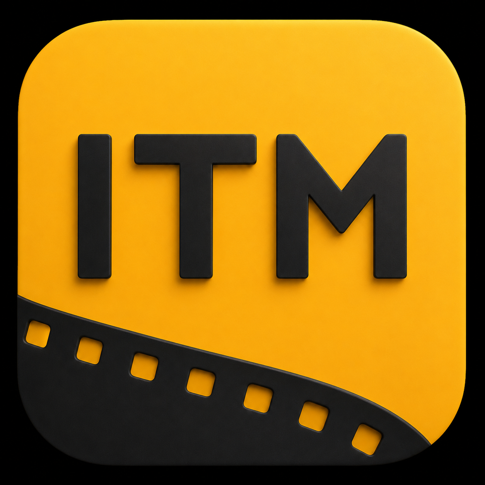

<div align="center">

# IMDb Tech Manager

[简体中文](./README.md) | [繁體中文](./README.zh-Hant.md) | [English](./README.en.md) | [Français](./README.fr.md) | [Русский](./README.ru.md) | [日本語](./README.ja.md) | **Español** | [ไทย](./README.th.md)

[](https://github.com/Eric-Hou1997/IMDb-Tech-Manager/releases)
[](https://github.com/Eric-Hou1997/IMDb-Tech-Manager/releases)



Gestión de especificaciones técnicas y metadatos para bibliotecas multimedia.

</div>

## Descripción

IMDb Tech Manager (ITM) obtiene y estructura las IMDb Technical Specifications. La información sobre cámaras, objetivos, formatos de captura, sonido, relaciones de aspecto y procesos de producción puede guardarse de forma segura en NFO. También incluye Inspector, vista previa, deshacer, tareas por lotes y gestión de etiquetas técnicas mediante reglas locales o IA.

ITM puede combinarse con [Tech Card Manager (TCM)](https://github.com/Eric-Hou1997/Tech-Card-Manager):

```text
IMDb → ITM → NFO / Technical Specifications → TCM → visualización en Emby
```

## Versión y plataforma

- Versión estable: [`v4.1.0`](https://github.com/Eric-Hou1997/IMDb-Tech-Manager/releases/tag/v4.1.0)
- Plataforma: macOS 12 o posterior, Apple Silicon (arm64)
- Archivo: `ITM-v4.1.0-MacOS-AArch64-APP.zip`
- Nombre estable dentro del ZIP: `IMDb Tech Manager.app`
- La Release incluye SHA-256, firma OTA Ed25519, instrucciones y registro de cambios

## Funciones principales

- Obtención, caché y estructuración de IMDb Technical Specifications
- Escritura NFO limitada de forma segura a `<technicalspecs>`
- Inspector, vista previa, comprobación del hash de origen, copia de seguridad y deshacer
- Propiedad diferenciada para etiquetas External, Generated y Manual
- Búsqueda, filtros, selección y tareas independientes para películas y series
- Proveedores de IA OpenAI-compatible y Anthropic intercambiables
- Contabilidad real de solicitudes HTTP, tokens, caché y coste
- OTA que diferencia proxy, límites de GitHub, recursos ausentes, descarga y firma

## Idiomas

El chino simplificado, el chino tradicional y el inglés (Estados Unidos) están integrados. El francés, ruso, japonés, español y tailandés se distribuyen como paquetes separados en la Release `v4.1.0` y solo se cargan después de descargarlos y verificarlos.

La Web UI, Go Core, Python Engine y los menús nativos de macOS comparten el idioma. El idioma del registro y de la revisión se fija al iniciar cada tarea. Cambiar la interfaz no reescribe registros históricos, cachés, NFO, información de propiedad ni prompts.

## Límites de seguridad

- Spec Agent solo puede modificar `<technicalspecs>` y nunca los `<tag>` raíz.
- La automatización solo modifica Generated Tech Tags cuya propiedad está demostrada.
- Se conservan las etiquetas External, Manual, TMM y de otras aplicaciones.
- Se preservan o verifican XML, BOM UTF-8, finales de línea, permisos, copias y reemplazo atómico.
- Una ruta ambigua, un conflicto de propiedad o un archivo modificado tras la vista previa detiene la operación de forma segura.

## Interfaz


## Hoja de ruta

Completado: publicación para Apple Silicon, seguridad y propiedad NFO, etiquetas Local/IA, tareas y uso, interfaz integrada en tres idiomas, cinco idiomas descargables, actualización vinculada a versión y controles de regresión.

En curso: normalización de Technical Specifications, más pruebas con bibliotecas reales, compatibilidad de proveedores IA, recuperación de errores, firma Developer ID y notarization, y otras plataformas y servidores multimedia.

## Desarrollo y licencia

Lee [`AGENTS.md`](./AGENTS.md) antes de contribuir. El diseño de los paquetes está en [`docs/language-packs.md`](./docs/language-packs.md).

Proyecto bajo [Apache License 2.0](./LICENSE). IMDb, Emby y las demás marcas pertenecen a sus propietarios. Este proyecto no está afiliado, autorizado ni respaldado por IMDb.com, Inc. o Emby LLC.
