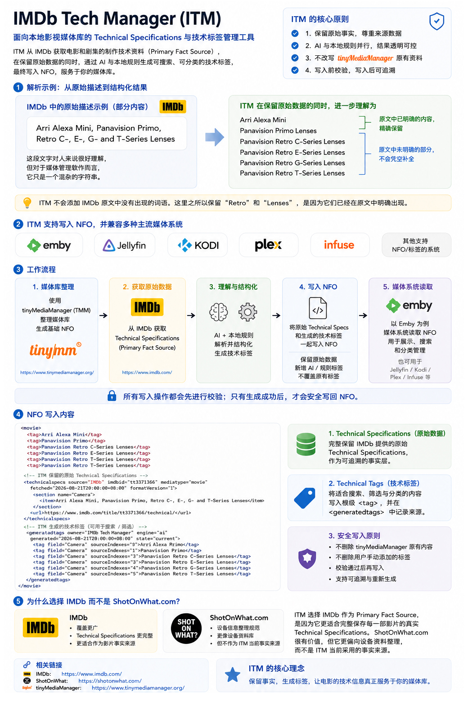
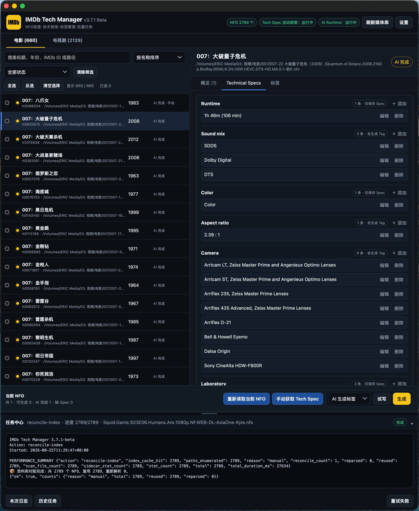

<div align="center">

# IMDb Tech Manager

**简体中文** | [English](./README.en.md)

<p align="center">

[](https://github.com/Eric-Hou1997/IMDb-Tech-Manager/releases)
[](https://github.com/Eric-Hou1997/IMDb-Tech-Manager/releases)
[](https://github.com/Eric-Hou1997/IMDb-Tech-Manager/stargazers)
[](https://github.com/Eric-Hou1997/IMDb-Tech-Manager/pulls)

</p>

影视技术规格与媒体库元数据管理工具

**🚧 持续开发中 · 源码将在准备完成后开放**

---

## 🎬 项目简介

**IMDb Tech Manager** 是一个面向影视作品技术信息管理的项目。

<br>



</div>

</p>

项目主要关注 **IMDb Technical Specifications（IMDb 技术规格）** 的获取、结构化、标准化与应用，将原本比较分散的影视制作技术资料转化为可以在个人媒体库中管理、检索和展示的元数据。

目前主要关注：

* IMDb Technical Specifications
* NFO 元数据管理
* 技术标签生成
* 摄影机与镜头信息
* 胶片与数字采集格式
* 制作与放映规格
* 技术元数据标准化
* 媒体库技术信息展示
* AI 辅助语义处理
* Coding Agent 辅助开发

现在的大多数媒体库已经可以很好地展示片名、演员、年份、分辨率、编码格式和音频格式。

但一部影视作品**使用了什么摄影机、什么镜头、采用什么胶片或数字采集格式、经过怎样的制作流程，以及最终以什么规格完成和放映**，通常并没有得到完整、结构化的保存和展示。

IMDb Tech Manager 希望把这些信息真正带进个人影视媒体库的工作流中。

---

## 🖼️ 界面预览

### 数据管理

<div align="center">



</div>

</p>

nfo数据管理端用于 IMDb Technical Specifications 获取、技术规格整理、标签生成以及批量任务管理。

### NFO 管理

<div align="center">


</div>

</p>

Tag 管理功能用于检查、预演和修改媒体库中的技术元数据，并允许用户对自动生成的内容进行手动修正。

### 媒体库技术规格展示

<div align="center">


</div>

</p>

经过处理的技术规格可以进一步用于媒体库中的技术信息展示。

---

## 🔄 核心工作流

```text
IMDb Technical Specifications
        ↓
数据获取与结构化
        ↓
技术规格标准化
        ↓
NFO 元数据管理
        ↓
技术标签生成
        ↓
媒体库中的技术信息展示
```

项目的目标并不是简单保存 IMDb 页面上的原始文字，而是希望把这些技术规格转化为可以：

* 管理
* 标准化
* 手动修正
* 搜索
* 标签化
* 展示
* 被其他工具继续利用

的结构化信息。

---

## 📚 主要技术信息

IMDb Technical Specifications 中包含大量影视制作技术资料，例如：

* 📷 摄影机（Cameras）
* 🔭 摄影镜头（Lenses）
* 🎞️ 胶片采集格式
* 💾 数字采集格式
* 🎥 摄影工艺（Cinematographic Process）
* 🧪 实验室与后期制作流程
* 🖼️ 画幅比例（Aspect Ratio）
* 🔊 声音格式（Sound Mix）
* 📽️ 母版与放映格式
* 🎬 Printed Film Format
* 其他与制作相关的 Technical Specifications

IMDb Tech Manager 将围绕这些数据建立解析、标准化、元数据管理和展示能力。

---

## 🧩 项目架构

从职责上看，IMDb Tech Manager 主要分成两个方向。

### 📦 数据管理端

数据管理端负责技术规格的获取、处理、检查和元数据维护。

主要职责包括：

* IMDb Technical Specifications 数据获取
* Technical Specifications 结构化
* NFO 文件管理
* Technical Specifications 写入 NFO
* 技术标签生成
* 技术规格标准化
* AI 辅助语义处理
* Preview / Dry Run
* 手动修正
* 批量处理
* 元数据维护

### 🖥️ 媒体库展示与集成端

媒体库展示与集成端负责将已经处理好的技术信息应用到媒体库中。

主要职责包括：

* 技术规格卡片
* 技术信息展示
* 元数据同步
* Web UI 集成
* 不同媒体类型的兼容处理
* 与媒体库元数据工作流联动

### 🧭 平台关系

这两个方向在架构上**不与某一个操作系统永久绑定**。

这里描述的是模块职责，而不是平台限制。

目前实际已经实现或正在重点开发的是：

* 一个当前运行于 **macOS** 的数据管理工具
* 一套当前围绕 **Emby** 开发的媒体库展示与集成方案

这些只是现阶段已经存在的实现，并不代表项目未来只能运行在这些平台上。

后续可以继续扩展：

* 其他操作系统
* 其他媒体服务器
* 其他部署方式
* 其他客户端

---

## 🧠 项目设计原则

### 1. 确定性规则优先

对于可以通过明确规则可靠解决的问题，优先使用本地确定性逻辑。

例如：

* 已知格式映射
* 标签标准化
* 数据结构转换
* NFO 操作
* 文件处理
* 数据验证

不会为了使用 AI 而刻意把这些任务交给 AI。

### 2. AI 处理模糊语义

AI 更适合处理：

* 不规则自然语言
* 有歧义的技术规格
* 语义拆分
* 固定规则难以完整覆盖的表达

AI 是系统中的一个能力模块，而不是整个项目唯一的基础。

### 3. AI Provider 可替换

模型层会尽量保持可配置。

典型配置包括：

```text
Provider
Base URL
API Key
Model
```

这样可以根据模型能力、调用成本、可用性、部署环境和隐私要求切换不同的模型服务。

### 4. 修改前先预演

涉及副作用的操作原则上优先遵循：

```text
Preview / Dry Run
        ↓
用户确认
        ↓
正式执行
```

尤其适用于：

* NFO 修改
* 技术标签写入
* 元数据变更
* 批量操作

### 5. 尊重用户维护的数据

自动生成的数据不应该在没有明确理由的情况下覆盖用户手动维护的元数据。

用户自己增加、修改和修正过的数据应该继续由用户掌控。

### 6. 后台行为可观察、可验证

项目希望尽可能让重要后台行为透明。

例如可以看到：

* 处理了什么
* 修改了什么
* 哪些结果来自本地规则
* 哪些结果来自 AI
* API 调用次数
* Token 使用情况
* Cache 命中情况
* 估算费用
* 任务结果
* 错误以及受影响的项目

---

## 🤖 面向 Coding Agent 的开发

IMDb Tech Manager 也希望探索一种更加适合现代 Coding Agent 的开发方式。

源码正式开放后，Repository 计划同时提供：

**`AGENTS.md`**

它会作为 Coding Agent 理解整个项目的重要入口。

计划包含：

* 项目目标
* 软件架构
* Repository 目录结构
* 各模块职责
* 模块边界
* 开发原则
* 不应该破坏的设计约束
* 编码规范
* 测试要求
* 构建方式
* Release 流程
* 已知问题
* 常见开发陷阱
* 完成代码修改前需要执行的检查

希望未来开发者 Fork 或 Clone 项目后，可以直接使用 Codex 等 Coding Agent：

```text
Fork / Clone
        ↓
Coding Agent 读取 AGENTS.md
        ↓
理解项目架构和开发规则
        ↓
分析受到影响的模块
        ↓
制定修改方案
        ↓
修改代码
        ↓
运行测试
        ↓
验证结果
        ↓
提交 Pull Request
```

项目未来希望开放的不只有源代码。

还会尽可能同时开放：

```text
源代码
  +
架构知识
  +
开发规则
  +
测试方法
  +
Agent Context
```

希望降低开发者和 Coding Agent 理解、修改和扩展这个项目的门槛。

---

## 🚧 当前状态

IMDb Tech Manager 目前仍处于 **活跃开发阶段**。

当前公开 Repository 主要用于：

* 📖 项目介绍与文档
* 🧭 Roadmap
* 💬 功能讨论
* 🏗️ 架构讨论
* 🧪 开发思路验证
* 🐛 问题反馈
* 🤝 社区交流

### 源代码

**项目源码目前尚未正式公开。**

正式开放源码之前，还需要完成：

* 代码整理
* 敏感信息检查
* Git 历史检查
* Repository 结构整理
* 测试完善
* 开发文档整理
* `AGENTS.md`
* License 确认
* Release 流程整理

完成公开发布准备后，源码会加入当前 Repository。

---

## 🗺️ Roadmap

* [ ] 完善公开项目文档
* [ ] 整理并记录项目架构
* [ ] 完成源码公开前安全检查
* [ ] 检查公开前 Git 历史
* [ ] 整理并发布 `AGENTS.md`
* [ ] 建立稳定的测试流程
* [ ] 开放核心源码
* [ ] 建立标准 Release 流程
* [ ] 完善 Technical Specifications 标准化规则
* [ ] 扩展更多技术规格数据
* [ ] 改进媒体库技术信息展示
* [ ] 探索更多操作系统支持
* [ ] 探索更多媒体服务器支持
* [ ] 完善 Coding Agent 开发工作流

Roadmap 会随着项目继续开发而调整。

---

## 💬 Discussions

功能想法、技术方案、UI 设计、数据标准化规则、媒体库集成方式以及开发工作流都欢迎在这里讨论：

[**进入 GitHub Discussions →**](https://github.com/Eric-Hou1997/IMDb-Tech-Manager/discussions)

如果一个想法暂时还不够明确，不适合直接成为 Issue，也很适合先放到 Discussions 中交流。

---

## 🐛 Issues

明确的 Bug、能够复现的问题以及已经比较清晰的功能需求，可以提交到：

[**GitHub Issues →**](https://github.com/Eric-Hou1997/IMDb-Tech-Manager/issues)

---

## 🤝 Contributing

项目源码目前尚未正式公开。

现阶段主要欢迎通过 Discussions 和 Issues 提供：

* 功能建议
* 技术方案
* 元数据标准化建议
* 摄影机 / 镜头 / 制作格式资料
* UI / UX 反馈
* Bug 信息
* 媒体库集成方案
* Agent 工作流建议

源码开放后，会进一步提供完整的贡献指南和 Coding Agent 开发说明。

---

## 📄 License

项目目前尚未最终确定开源许可证。

正式开放源码之前，会加入明确的 `LICENSE` 文件，说明源码的使用、修改和分发规则。

---

## ⚠️ 免责声明

IMDb Tech Manager 是一个独立开发项目。

本项目**与 IMDb、Emby 以及其他第三方平台不存在官方隶属、授权或背书关系**。

相关第三方名称、商标、数据和服务归各自权利方所有。

用户在使用第三方数据或服务时，应自行确保相关使用方式符合适用的服务条款和法律要求。

---

## 💡 反馈与建议

IMDb Tech Manager 仍然处于持续发展阶段。

如果你对 IMDb 技术数据、标准化规则、摄影机与镜头资料、媒体库展示方式、其他媒体服务器支持、工作流自动化或 Coding Agent 集成有想法，欢迎到 Discussions 中交流。

即使现在还不知道具体应该怎样实现，也可以先把想法提出来。
