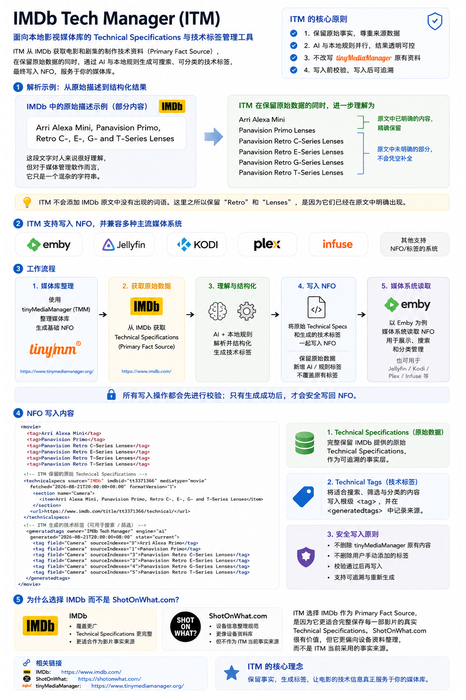
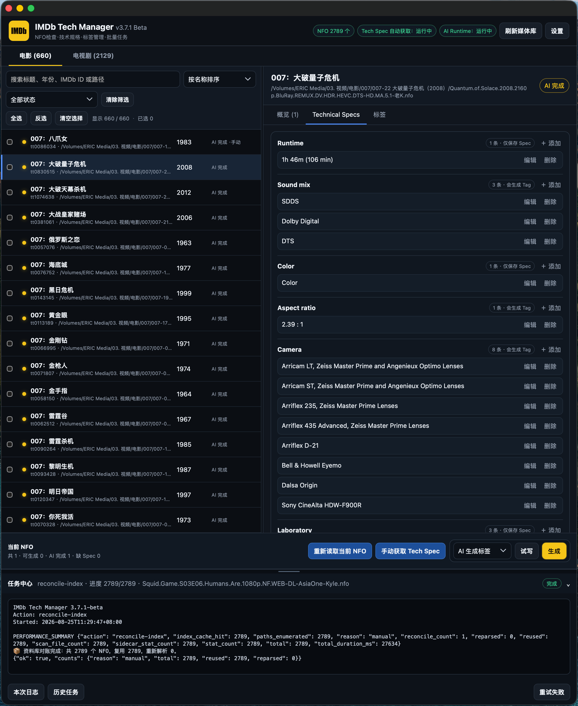
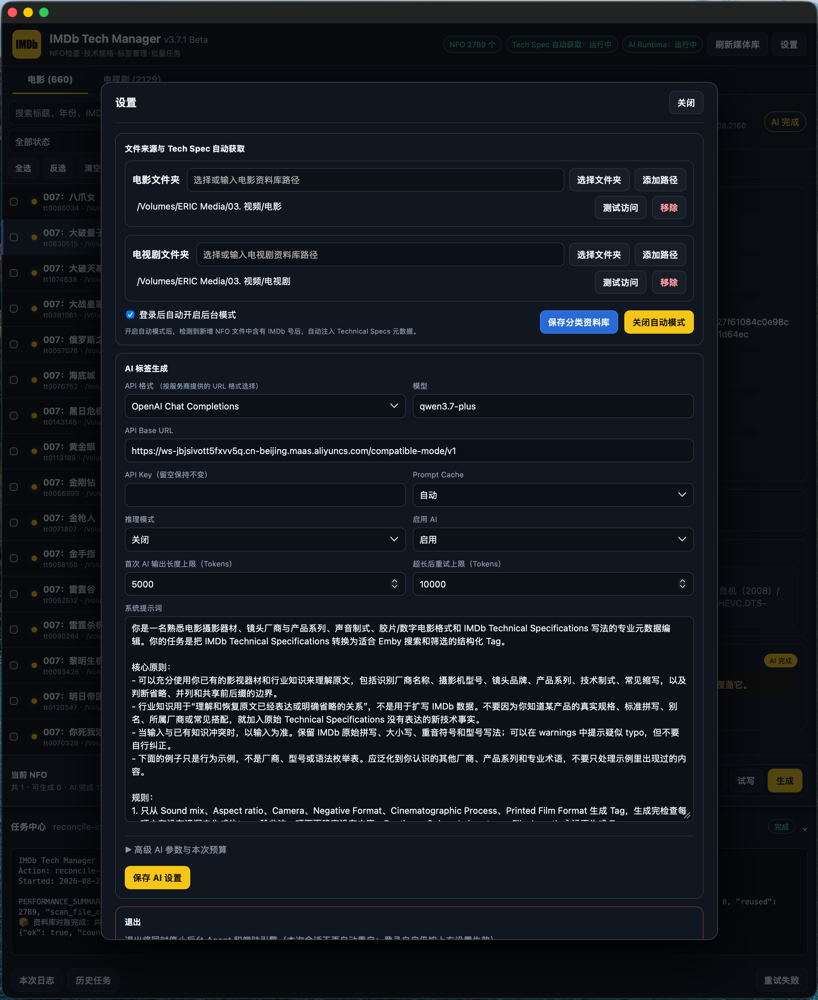

<div align="center">

# IMDb Tech Manager

[简体中文](../../README.md) | [繁體中文](./README.zh-Hant.md) | [English](./README.en.md) | **Français** | [Русский](./README.ru.md) | [日本語](./README.ja.md) | [Español](./README.es.md) | [ไทย](./README.th.md)

<p align="center">

[](https://github.com/Eric-Hou1997/IMDb-Tech-Manager/releases)
[](https://github.com/Eric-Hou1997/IMDb-Tech-Manager/releases)
[](https://github.com/Eric-Hou1997/IMDb-Tech-Manager/stargazers)
[](https://github.com/Eric-Hou1997/IMDb-Tech-Manager/pulls)

</p>


Gestion des spécifications techniques et des métadonnées pour les films et les médiathèques.

---

## 🎬 À propos

**IMDb Tech Manager** est un projet consacré à la gestion des informations techniques des productions cinématographiques et télévisuelles.

</p>



</div>

</p>

Le projet se concentre sur l’acquisition, la structuration, la normalisation et l’application des **IMDb Technical Specifications**, afin de transformer des informations de production dispersées en métadonnées structurées, consultables et exploitables dans une médiathèque personnelle.

Ses principaux domaines sont :

* les IMDb Technical Specifications ;
* la gestion des métadonnées NFO ;
* la génération de tags techniques ;
* les informations sur les caméras et objectifs ;
* les formats de captation argentique et numérique ;
* les formats de production et de présentation ;
* la normalisation des métadonnées techniques ;
* la présentation des informations techniques dans les médiathèques ;
* le traitement sémantique assisté par IA ;
* le développement assisté par Coding Agents.

La plupart des médiathèques affichent déjà très bien les titres, interprètes, années de sortie, résolutions, codecs et formats audio.

En revanche, elles conservent rarement de façon complète et structurée **les caméras et objectifs employés, les formats de captation argentique ou numérique, les procédés de production, ainsi que les formats de masterisation et de présentation de l’œuvre finale**.

IMDb Tech Manager vise à intégrer ces informations au flux de travail d’une médiathèque personnelle.

---

## 🖼️ Captures d’écran

### Gestion des données

<div align="center">



</div>

</p>

L’interface de gestion des données NFO sert à acquérir les IMDb Technical Specifications, organiser les spécifications techniques, générer les tags et gérer les tâches par lots.

### Gestion des NFO

<div align="center">


</div>

</p>

La gestion des tags permet d’inspecter, prévisualiser et modifier les métadonnées techniques de la médiathèque, tout en autorisant la correction manuelle du contenu généré automatiquement.

### Gestion de l’environnement d’exécution IA

<div align="center">



</div>

</p>

Cette interface permet de configurer les points de terminaison des modèles, les API Base URLs, le Prompt Cache, les paramètres d’inférence, les invites système et les autres comportements associés à la génération de tags par IA.

### Spécifications techniques dans la médiathèque

<div align="center">


</div>

</p>

Les spécifications techniques traitées peuvent ensuite servir à présenter les informations techniques dans les médiathèques.

---

## 🔄 Flux de travail principal

```text
IMDb Technical Specifications
        ↓
Acquisition et structuration des données
        ↓
Normalisation des spécifications techniques
        ↓
Gestion des métadonnées NFO
        ↓
Génération des tags techniques
        ↓
Présentation des informations techniques dans les médiathèques
```

L’objectif n’est pas seulement de conserver le texte brut des pages IMDb. Le projet cherche à transformer ces spécifications en informations structurées pouvant être :

* gérées ;
* normalisées ;
* corrigées manuellement ;
* recherchées ;
* converties en tags ;
* présentées ;
* réutilisées par d’autres outils.

---

## 📚 Informations techniques

Les IMDb Technical Specifications couvrent de nombreux aspects des productions cinématographiques et télévisuelles :

* 📷 caméras ;
* 🔭 objectifs ;
* 🎞️ formats de captation argentique ;
* 💾 formats de captation numérique ;
* 🎥 procédés cinématographiques ;
* 🧪 procédés de laboratoire et de postproduction ;
* 🖼️ rapports d’image ;
* 🔊 mixages sonores ;
* 📽️ formats de masterisation et de présentation ;
* 🎬 formats de copie film ;
* autres spécifications techniques liées à la production.

IMDb Tech Manager développe autour de ces informations des fonctions d’analyse, de normalisation, de gestion des métadonnées et de présentation.

---

## 🧩 Architecture du projet

IMDb Tech Manager (ITM) et [Tech Card Manager (TCM)](https://github.com/Eric-Hou1997/Tech-Card-Manager) coopèrent autour du même flux de **Technical Specifications**.

Les deux outils interviennent à des étapes différentes :

* **ITM** assure l’acquisition, le traitement, l’inspection et la maintenance des spécifications techniques et métadonnées associées.
* **TCM** applique les spécifications traitées aux médiathèques — par exemple en générant les cartes Technical Specifications dans Emby — et prend en charge leur présentation et leur intégration.

ITM et TCM sont indépendants et conçus pour fonctionner ensemble, mais chacun peut aussi être utilisé et développé séparément.

### 📦 IMDb Tech Manager (ITM)

**IMDb Tech Manager (ITM)** est principalement chargé de la gestion et du traitement des données Technical Specifications.

Ses responsabilités comprennent :

* l’acquisition des IMDb Technical Specifications ;
* leur structuration ;
* leur normalisation ;
* la gestion des fichiers NFO ;
* l’écriture des Technical Specifications dans les NFO ;
* la génération des tags techniques ;
* le traitement sémantique assisté par IA ;
* Preview / Dry Run ;
* la correction manuelle ;
* le traitement par lots ;
* la maintenance des métadonnées.

ITM transforme les spécifications brutes en métadonnées stables, structurées et faciles à maintenir.

TCM peut ensuite utiliser ces Technical Specifications pour générer, présenter et synchroniser les cartes correspondantes dans les médiathèques.

### 🖥️ [Tech Card Manager (TCM)](https://github.com/Eric-Hou1997/Tech-Card-Manager)

**Tech Card Manager (TCM)** assure principalement la présentation et l’intégration des Technical Specifications dans les médiathèques.

Ses responsabilités comprennent :

* la lecture des Technical Specifications fournies par ITM ou une source compatible ;
* la génération et la maintenance des cartes ;
* la présentation des informations techniques ;
* la synchronisation des métadonnées ;
* l’intégration Web UI ;
* la compatibilité entre les types de médias ;
* l’intégration aux flux de métadonnées des médiathèques.

TCM et ITM partagent le même modèle de données Technical Specifications tout en conservant des responsabilités distinctes.

ITM acquiert, organise et maintient les informations techniques ; TCM applique ces données aux environnements de médiathèque réels.

Ensemble, ils forment un flux complet :

**IMDb → ITM → NFO / Technical Specifications → TCM → Présentation dans la médiathèque**

### 🧭 Relation entre les plateformes

Les responsabilités d’ITM et de TCM ne sont **pas définitivement liées à un système d’exploitation ou à un serveur multimédia particulier**.

Les implémentations actuellement disponibles ou développées activement sont :

* **ITM** : application de gestion des Technical Specifications avec des fichiers de distribution pour **macOS, Windows et Linux** ;
* **TCM** : outil de gestion de cartes et d’intégration aux médiathèques actuellement centré sur **Emby**.

Il s’agit uniquement des implémentations actuelles, sans limiter définitivement les projets à ces plateformes.

Les extensions futures peuvent inclure :

* d’autres systèmes d’exploitation ;
* d’autres serveurs multimédias ;
* d’autres méthodes de déploiement ;
* d’autres applications clientes ;
* d’autres sources compatibles de Technical Specifications.

ITM et TCM restent relativement indépendants sur le plan architectural et communiquent par des Technical Specifications et métadonnées normalisées, ce qui laisse la voie ouverte à d’autres plateformes et médiathèques.


v5.0.0 conserve les fonctions, l’interface et les opérations de v4.1.0 ; seuls la pile technique et l’adaptation aux plateformes changent.

## 🧠 Principes de conception

L’un des objectifs centraux d’IMDb Tech Manager est de rendre l’automatisation **contrôlable, inspectable et récupérable**.

Qu’une tâche utilise des règles locales déterministes ou l’IA, la priorité est de maintenir les métadonnées de manière fiable plutôt que de maximiser l’automatisation.

### 1. Privilégier les règles déterministes

Lorsqu’un problème peut être résolu de façon fiable avec des règles explicites, la logique locale déterministe est privilégiée.

Exemples :

* correspondances de formats connues ;
* normalisation des spécifications ;
* règles de tags ;
* transformation des structures de données ;
* lecture et écriture NFO ;
* traitement de fichiers ;
* validation des données ;
* détermination de la propriété.

Ces tâches ont des entrées et sorties clairement définies, ce qui facilite les tests, la reproduction et la vérification.

Une tâche solvable de manière fiable par des règles n’est pas confiée à l’IA uniquement pour employer l’IA.

### 2. Employer l’IA pour les ambiguïtés sémantiques

L’IA sert principalement aux problèmes sémantiques difficiles à couvrir entièrement par des règles fixes :

* descriptions irrégulières en langage naturel ;
* spécifications ambiguës ;
* décomposition sémantique complexe ;
* identification des relations entre fabricants, séries et modèles ;
* normalisation de formulations multiples ;
* informations exigeant une interprétation contextuelle.

L’IA est une capacité parmi d’autres dans IMDb Tech Manager.

Elle complète les domaines où les règles sont moins efficaces sans remplacer le pipeline global.

### 3. Garder les fournisseurs d’IA interchangeables

La couche de modèle reste configurable et accepte différents services au moyen de paramètres tels que :

```text
Provider
Base URL
API Key
Model
```

L’utilisateur peut ainsi choisir un service selon :

* les capacités du modèle ;
* le coût de l’API ;
* la disponibilité ;
* la compatibilité de l’API ;
* l’environnement de déploiement ;
* les exigences de confidentialité.

Le flux de données principal n’est pas lié définitivement à un fournisseur.

### 4. Prévisualiser avant d’écrire

Les opérations qui modifient des NFO ou métadonnées doivent, lorsque c’est possible, fournir un résultat inspectable avant l’écriture effective.

Flux typique :

```text
Preview / Dry Run
        ↓
Examiner les modifications
        ↓
Exécuter
        ↓
Vérifier le résultat
```

C’est particulièrement important pour :

* les modifications NFO ;
* l’écriture des Technical Specifications ;
* la génération des tags ;
* la mise à jour des tags ;
* les opérations par lots ;
* les migrations de métadonnées.

Pour les traitements par lots, savoir ce qui va changer importe davantage que maximiser la vitesse.

### 5. Respecter les données maintenues par l’utilisateur

IMDb Tech Manager distingue les métadonnées selon leur source et leur propriété.

Les processus automatiques ne peuvent modifier que les données que l’application identifie avec autorité comme siennes. Une simple ressemblance de texte ne permet jamais de déduire la propriété d’un tag.

En particulier :

* les tags maintenus manuellement ;
* les tags générés par des outils externes ;
* les données maintenues par des applications comme TMM ;
* les données dont la propriété est inconnue

ne doivent jamais être supprimés, revendiqués ou remplacés silencieusement par une tâche en arrière-plan.

Un Generated Tech Tag modifié manuellement devient une donnée utilisateur protégée.

### 6. Séparer Technical Specifications et Tags

Le projet traite les **Technical Specifications** comme couche factuelle et les **Tags** comme données dérivées.

```text
Technical Specifications
        ↓
Normalisation / Traitement sémantique
        ↓
Technical Tags
```

Par conséquent :

* Spec Agent ne gère que les Technical Specifications ;
* les générateurs de tags ne gèrent que les Technical Tags ;
* modifier les Technical Specifications ne doit pas déclencher implicitement une actualisation IMDb ;
* la reconstruction des tags reste une opération indépendante et observable.

Cette séparation évite les interférences entre étapes et facilite la régénération des tags ou l’intégration future d’autres outils.

### 7. Garantir la sûreté des écritures

Les NFO sont des données durables importantes ; les modifications doivent donc minimiser les risques d’écriture partielle, de suppression accidentelle de tags ou de corruption.

Le projet renforce continuellement :

* la validation XML ;
* les sauvegardes préalables ;
* la vérification de l’état du fichier d’origine ;
* les écritures atomiques ;
* la validation des chemins ;
* la vérification de propriété des tags ;
* la détection des conflits ;
* la conservation intacte du fichier en cas d’échec ;
* les fonctions de récupération et d’annulation.

Lorsque le système ne peut pas déterminer sûrement si une donnée doit être modifiée, il ignore l’opération plutôt que de risquer une écriture dangereuse.

### 8. Rendre les tâches d’arrière-plan observables et vérifiables

Les opérations importantes doivent exposer un état clair lorsque c’est possible :

* élément en cours de traitement ;
* modifications effectuées ;
* résultats issus des règles locales ;
* résultats issus de l’IA ;
* nombre d’appels API ;
* consommation de Tokens ;
* hits de Cache ;
* coût estimé ;
* phase actuelle ;
* états succès / échec / ignoré ;
* motifs d’erreur ;
* titres ou fichiers NFO concernés.

Le projet évite de résumer un travail complexe à un simple message « succès » sans expliquer ce qui s’est réellement passé.

---

## 🤖 Développement avec des Coding Agents

Le dépôt public comprend :

[**`AGENTS.md` →**](../../AGENTS.md)

Ce fichier fournit un contexte essentiel aux Coding Agents comme Codex lorsqu’ils analysent et modifient le projet.

`AGENTS.md` couvre notamment :

* l’identité du dépôt et les limites des sources ;
* les responsabilités actuelles du produit ;
* les contraintes d’architecture ;
* la sûreté NFO ;
* la propriété des tags ;
* les appels IA et la comptabilisation des Tokens ;
* la gestion du cycle de vie ;
* les exigences de test et de vérification ;
* les limites de publication ;
* la signature OTA ;
* les limites de prise en charge des plateformes ;
* les modifications interdites ;
* les contrôles requis avant de terminer une modification.

Après un Fork ou un Clone, les développeurs peuvent demander à un Coding Agent disposant du Repository Context de lire `AGENTS.md` avant toute analyse ou modification.

Flux recommandé :

```text
Fork / Clone
        ↓
Le Coding Agent lit AGENTS.md
        ↓
Lire le code source et les tests concernés
        ↓
Comprendre les responsabilités et limites des modules
        ↓
Analyser les parcours fonctionnels touchés
        ↓
Établir un plan d’implémentation
        ↓
Modifier le code
        ↓
Exécuter les tests pertinents
        ↓
Vérifier le comportement réel
        ↓
Soumettre une Pull Request
```

IMDb Tech Manager cherche à fournir plus que le seul code source :

```text
Code source
    +
Connaissance de l’architecture
    +
Contraintes de conception
    +
Règles de développement
    +
Méthodes de test
    +
Contexte pour les agents
```

Cela aide les développeurs directs comme ceux utilisant Codex à comprendre plus vite le projet et réduit le risque d’une modification techniquement fonctionnelle mais contraire aux contraintes existantes.

---

## 🚧 État actuel

IMDb Tech Manager est un projet **open source en développement actif**.

L’historique public du code source commence à **v4.0.0**.

Le dépôt comprend actuellement :

* le code source complet ;
* Implémentations pour cinq cibles en Rust + Tauri 2 + TypeScript + Vue 3/Vite ;
* `AGENTS.md` ;
* les tests ;
* les outils de build des Releases ;
* la configuration du packaging ;
* la documentation ;
* `LICENSE` ;
* `NOTICE` ;
* `SECURITY.md` ;
* [`PRIVACY.md`](../legal/PRIVACY.fr.md) ;
* [`TERMS.md`](../legal/TERMS.fr.md).

### Cibles de la version actuelle

v5.0.0 conserve les fonctions, l’interface et les opérations de v4.1.0 ; seuls la pile technique et l’adaptation aux plateformes changent.

Cette distribution comprend cinq cibles et neuf formats de paquets, sans version macOS Intel :

* macOS ARM64 : DMG ; glissez `IMDb Tech Manager.app` dans Applications.
* Windows x64/ARM64 : NSIS `Setup.exe` ; choisissez l’installateur correspondant à l’architecture de l’application.
* Linux x64/ARM64 : AppImage, DEB et RPM ; AppImage requiert les droits d’exécution et ses dépendances. Installez et mettez à niveau DEB/RPM avec le gestionnaire de paquets système.

```text
Tauri 2 / System WebView
      +
Rust Core
      +
TypeScript + Vue 3 / Vite
```

v5 utilise un cœur Rust, la WebView système de Tauri et une interface TypeScript + Vue 3/Vite, sans moteurs métier Go/Python. Les sources, ressources et tests originaux de `macos/` restent la référence v4.1.0.

### Version officielle actuelle

**IMDb Tech Manager v5.0.0**

Les fichiers de v5.0.0 portent exactement les noms suivants :

```text
ITM-v5.0.0-MacOS-AArch64.dmg
ITM-v5.0.0-Windows-x64-Setup.exe
ITM-v5.0.0-Windows-AArch64-Setup.exe
ITM-v5.0.0-Linux-x64.AppImage
ITM-v5.0.0-Linux-x64.deb
ITM-v5.0.0-Linux-x64.rpm
ITM-v5.0.0-Linux-AArch64.AppImage
ITM-v5.0.0-Linux-AArch64.deb
ITM-v5.0.0-Linux-AArch64.rpm
```

`ITM-v5.0.0-MacOS-AArch64-APP.zip` et sa signature Ed25519 originale sont également fournis pour l’OTA v4.1.0. Les mises à jour v5 utilisent la même base avec `.tar.gz` et sa signature. Les mises à jour AppImage/NSIS vérifient l’architecture de l’application ; téléchargez DEB/RPM depuis la même Release et utilisez le gestionnaire système. Aucun dépôt logiciel n’est ajouté. Les données, invites, références aux identifiants et historiques d’annulation sont conservés ; sauvegardez avant la mise à niveau.

* le Changelog de la Release ;
* les informations de vérification SHA-256 ;
* la signature OTA Ed25519 ;
* les instructions d’installation.

Les paquets macOS sont signés ad hoc, sans notarisation Apple ; les installateurs Windows ne sont pas signés par un certificat de distribution. L’OTA conserve la clé ITM Ed25519 existante, dont la partie privée n’est jamais envoyée à GitHub. Les contrôles de contenu et de compilation ne certifient pas la prise en charge sur machines réelles.

Le mainteneur a reporté la validation complète des opérations natives, des pixels et des parcours AI/IMDb réels. Les machines Windows/Linux et la version minimale de macOS ne sont pas non plus certifiées. Les captures existantes proviennent de v4.1.0 et servent de référence à l’interface conservée ; elles ne valident pas les pixels de v5.

[**Voir les Releases →**](https://github.com/Eric-Hou1997/IMDb-Tech-Manager/releases)

Les cinq langues externes utilisent les ZIP r2 de cette Release, avec tous les textes originaux et les messages requis pour les tâches et plateformes. Les paquets r1 vérifiés restent utilisables hors ligne ; les anciens journaux ne sont pas réécrits.

Le chinois simplifié, le chinois traditionnel et l’anglais (États-Unis) sont intégrés. Le français, le russe, le japonais, l’espagnol et le thaï sont fournis comme packs de langue vérifiés avec la Release correspondante. Voir [`docs/language-packs.md`](../language-packs.md).

Le projet reste activement développé ; ses fonctionnalités, son architecture, ses tests et les plateformes prises en charge continueront d’évoluer.

---

## 🗺️ Feuille de route

### Terminé

* [x] Créer le dépôt public
* [x] Publier le code source principal
* [x] Établir la structure de base
* [x] Publier `AGENTS.md`
* [x] Choisir la licence open source
* [x] Établir le framework de test initial
* [x] Établir le flux de build des Releases
* [x] Publier la première version source publique, `v4.0.0`
* [x] Établir le flux de Release macOS Apple Silicon
* [x] Ajouter la vérification d’intégrité et la signature OTA
* [x] Publier `v4.1.0` avec chinois simplifié, chinois traditionnel et anglais (États-Unis) intégrés
* [x] Publier les packs français, russe, japonais, espagnol et thaï
* [x] Partager la langue entre Web UI, Core Go, moteur Python et menus macOS natifs
* [x] Figer la langue des journaux et de la révision au démarrage d’une tâche tout en conservant l’historique, les caches et les invites
* [x] Distinguer les échecs réseau/proxy, limitation GitHub, asset manquant, téléchargement et signature
* [x] Fournir la migration v5.0.0 pour cinq cibles et neuf paquets, en conservant les fonctions et l’interface ; les points non validés sont indiqués ci-dessus

### En cours

* [ ] Améliorer les règles de normalisation des Technical Specifications
* [ ] Étendre le traitement des Technical Specifications
* [ ] Améliorer la génération locale / IA des tags techniques
* [ ] Renforcer la propriété et la sûreté des données NFO
* [ ] Étendre les tests automatisés et régressions réelles
* [ ] Améliorer la localisation et la récupération des états et erreurs
* [ ] Améliorer la configuration des AI Providers et modèles
* [ ] Améliorer la comptabilisation des Tokens, du Cache et des coûts API
* [ ] Améliorer les mises à jour et Releases
* [ ] Améliorer la signature Developer ID et la distribution macOS
* [ ] Continuer à améliorer `AGENTS.md` et le contexte Coding Agent
* [ ] Améliorer les flux de contribution et Pull Request
* [ ] Étudier d’autres systèmes d’exploitation
* [ ] Améliorer l’intégration avec [Tech Card Manager (TCM)](https://github.com/Eric-Hou1997/Tech-Card-Manager)
* [ ] Étudier l’intégration avec d’autres serveurs multimédias et applications clientes

La feuille de route évoluera selon le développement et les retours réels.

---

## 💬 Discussions

Les idées de fonctionnalités, approches techniques, conceptions UI, règles de normalisation et méthodes de développement sont les bienvenues dans Discussions :

[**Accéder aux Discussions GitHub →**](https://github.com/Eric-Hou1997/IMDb-Tech-Manager/discussions)

Sujets appropriés :

* nouvelles fonctionnalités ;
* conception technique ;
* règles de données Technical Specifications ;
* informations caméras / objectifs / pellicules / formats de production ;
* suggestions UI / UX ;
* stratégies de génération de tags par IA ;
* flux ITM et TCM ;
* approches de développement avec Coding Agents ;
* idées nécessitant encore une exploration.

Si une idée doit encore être discutée et validée avant de devenir une tâche précise, commencez par Discussions avant d’ouvrir une Issue.

---

## 🐛 Issues

Pour un problème déjà clairement descriptible, ouvrez directement une Issue :

[**Issues GitHub →**](https://github.com/Eric-Hou1997/IMDb-Tech-Manager/issues)

Exemples :

* bugs reproductibles ;
* fonctionnalité clairement manquante ;
* erreurs d’analyse des données ;
* erreurs de normalisation ;
* problèmes de modification NFO ;
* problèmes de comportement UI ;
* problèmes de Release ou d’installation ;
* demandes de fonctionnalités bien définies.

Indiquez si possible la version, le type de média, les étapes de reproduction et les erreurs afin de faciliter le diagnostic.

---

## 🤝 Contribuer

IMDb Tech Manager est open source. Forks, recherches, modifications et Pull Requests sont bienvenus.

Avant de modifier le code, lisez :

[**`AGENTS.md` →**](../../AGENTS.md)

Il documente les règles d’architecture, les contraintes de sûreté des données, les tests requis et les limites de Release.

Comprenez notamment la conception existante avant de modifier :

* la lecture et l’écriture NFO ;
* les Technical Specifications ;
* les Technical Tags ;
* la propriété des tags ;
* les appels IA ;
* la comptabilisation Token / Cache ;
* les tâches par lots ;
* le cycle de vie de l’application ;
* le code propre aux plateformes ;
* les mises à jour et Releases.

Les contributions sont bienvenues, entre autres pour :

* corriger des bugs ;
* améliorer les fonctionnalités ;
* améliorer l’analyse des Technical Specifications ;
* améliorer leur normalisation ;
* enrichir les informations caméras / objectifs / formats de production ;
* ajouter des cas de test ;
* améliorer UI / UX ;
* améliorer performances et stabilité ;
* améliorer la documentation ;
* améliorer le contexte des Coding Agents.

Lors d’un changement de comportement, ajoutez autant que possible les tests ou vérifications de régression appropriés afin de ne pas réparer un problème en cassant un flux de métadonnées existant.

---

## 📄 Licence

IMDb Tech Manager est open source sous **Apache License 2.0**.

Licence complète :

[**LICENSE →**](../../LICENSE)

Le dépôt comprend aussi :

[**NOTICE →**](../../NOTICE)

Pour utiliser, modifier ou distribuer le code, respectez Apache License 2.0 et les notices incluses.

---

## ⚠️ Avertissement

IMDb Tech Manager est un projet open source développé indépendamment.

Ce projet n’est **ni affilié, ni autorisé, ni approuvé officiellement par IMDb, Emby ou une autre plateforme tierce**.

Tous les noms, marques, données et services tiers restent la propriété de leurs détenteurs.

IMDb Tech Manager fournit des outils d’acquisition et de traitement des spécifications techniques ainsi que de gestion des métadonnées.

Il appartient aux utilisateurs de vérifier que leur usage des données, API, sites et services tiers respecte les conditions d’utilisation, licences et lois applicables.

---

## 💡 Retours et suggestions

IMDb Tech Manager est toujours développé activement.

Vos idées sont bienvenues concernant :

* les IMDb Technical Specifications ;
* leur normalisation ;
* les informations caméras et objectifs ;
* les formats de captation argentique et numérique ;
* la gestion des métadonnées NFO ;
* les règles de tags techniques ;
* le traitement sémantique assisté par IA ;
* UI / UX ;
* la collaboration ITM / TCM ;
* d’autres systèmes d’exploitation ;
* les flux de développement avec Coding Agents.

Participez via Discussions ou Issues.

Le projet continuera de faire évoluer ses fonctionnalités, règles de données et orientations selon les retours du terrain.
